# KubeLeads
<!--
>EasyTP is a web based solution that aims to facilitate and >customize cluster management by automating 
>deployement for different Tools/software used in students labs allowing user >management ~~~ (microservices, fully distributed in LAN, NFS , >worker nodes ...)
-->

## About 

The present project consisted of developing and deploying a solution that would allow
students of the school to access the software that they use in practical labs without worrying about installation, compatibility and lack of resources often encountered, using containerization using Docker and deployment using Kubernetes.

The proposed solution consists of containerizing two chosen applications (based on usage frequency) and implementing a custom onsite Kubernetes cluster architecture to deploy and manage students/teachers access and activity to these applications through a common web plateform named **EasyTP**.


## Built with
* Docker 
* Kubernetes 
* Django
* PostgreSQL


## Project motivation
This project is a semester long project for 2CS Computer Systems speciality (SIQ).

## Chosen applications 
- Gns3
- Logisim 

## How did we dockerize them 

To dockerize and remotely access GUI applications, the container contains the following stack described in ./Dockerfiles/\<appname>/Dockerfile.

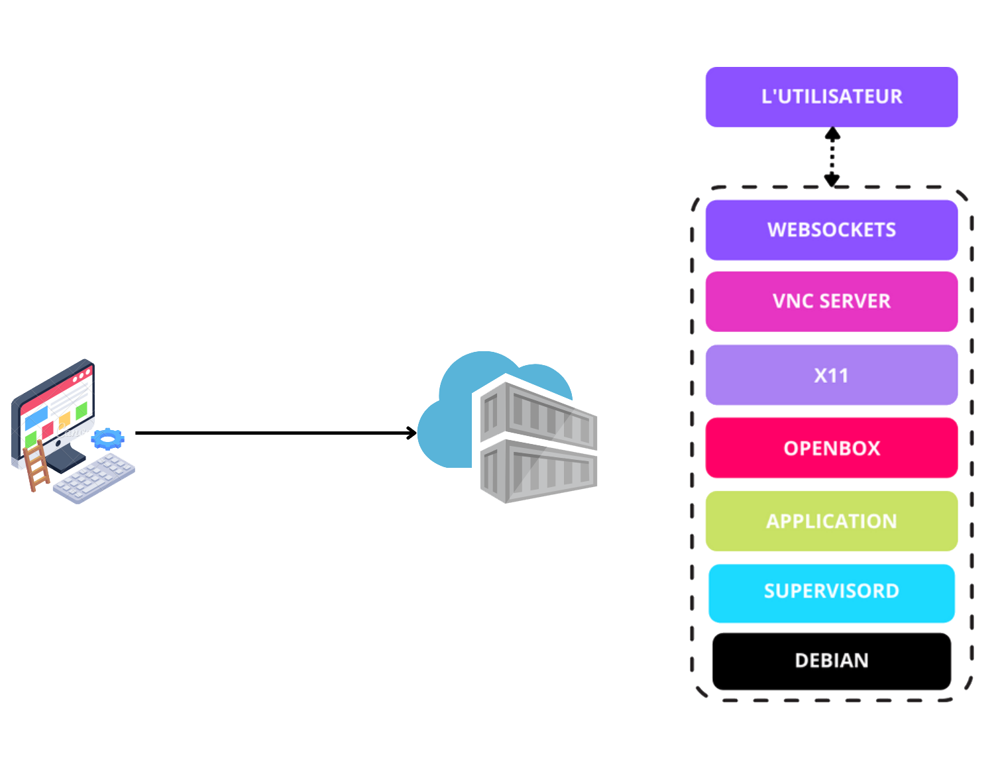
 
* Debian as the base image.
* Supervisord (insures/restrict application/user access inside container) described through supervisord.conf.
* Application and its dependencies
* Openbox (Windows manager) described through menu.xml file.
* x11 provided by TigerVNC
* VNC server provided by TigerVNC
* Websocket to view VNC content through browser provided by easy-novnc.


##  Kubernetes Cluster


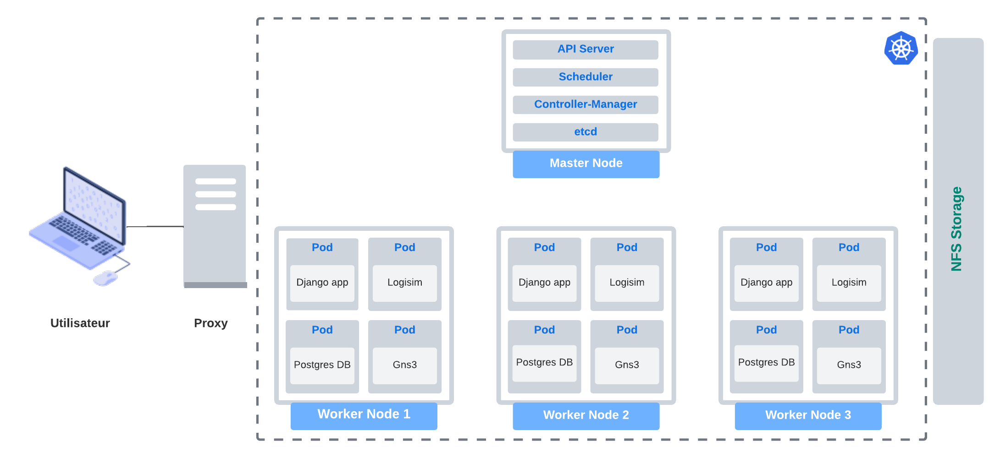

* Storage through NFS technology
* Networking through proxy / ingress.
* Deployement: the solution is ready to be deployed locally through LAN distributed cluster, VMs or through cloud (soon).

## EasyTP
EasyTP is a web application developed with Django that aims to
facilitate and customize cluster management according to our specific needs. It serves, in the first place,
authenticate the different users of the system, then communicates with the control plane to create pods and services associated with the applications requested by the users.
System users are : students, teachers and administrator.
Here are the functional and technical specifications of the EasyTP application in detail.

### Features
- The application starts a new pod and kubernetes service for each
application/user.
- The system allows all users to access the application from the
browser.
- The system allows all users of the application to authenticate themselves.
- The system allows to save the user's session for future use.
- The system allows to send an email to new users containing their usernames and passwords.
- The system should delete the pod/container after the user logs out.

We count 3 types of users:
#### 1. Administrator
- The system allows an "administrator" user to consult the dashboard.
- The system allows an "administrator" user to add a list of users from a CSV file.
- The administrator must be able to create, update and delete applications.
- The administrator must be able to assign applications to students.
- The administrator must be able to manage access and privileges.
#### 2. Teacher
- The system allows a "teacher" user to view all student pods.
- The system allows a "teacher" user to access any student's pod.
- The system allows a teacher user to access student storage spaces.
- The system allows a "teacher" user to launch applications.
- The system allows a teacher user to upload files related to the course to his/her own storage space to be shared with students.
#### 3. Student
- The system allows a "student" user to launch applications (Lab environement).
- The system allows a student user to upload files from his own local machine or from the space shared with the teacher to his allocated space.


### Screenshots
1. Authentication (only @esi.dz emails are allowed)

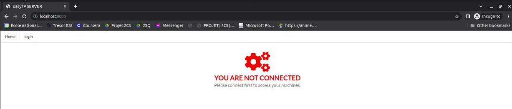
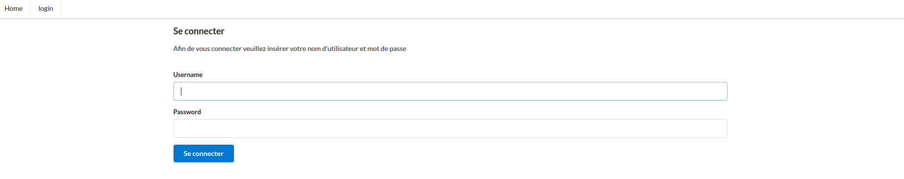
_Login page_

2. Student


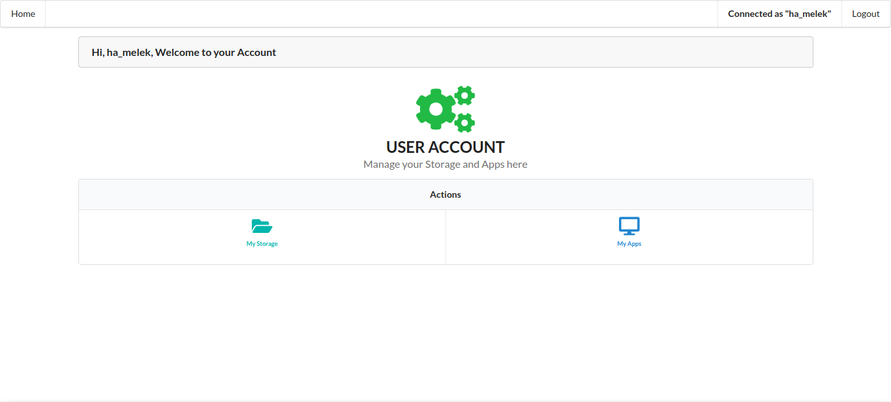
_student dashboard_


_file manager page_

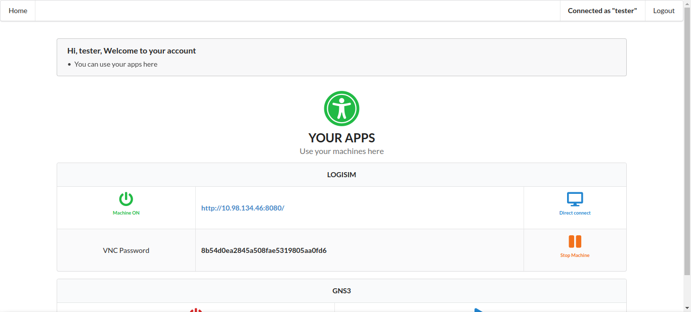
_Lab applications dashboard_

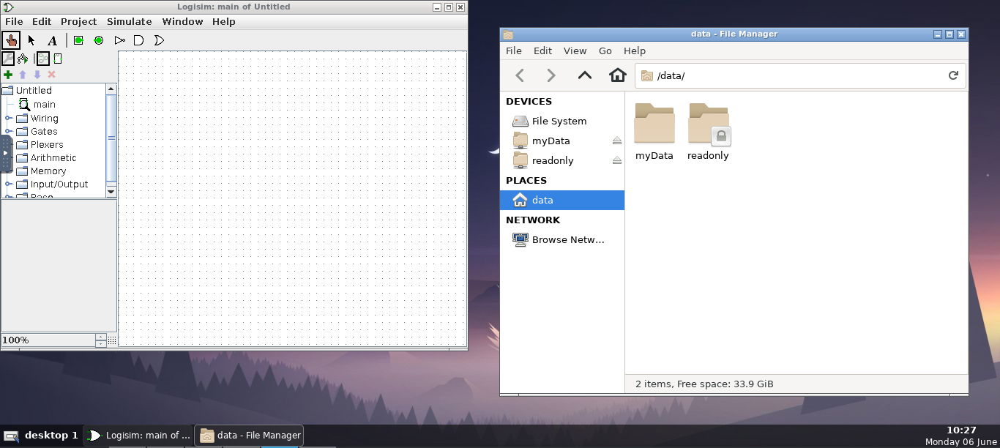
_Logisim application preview_

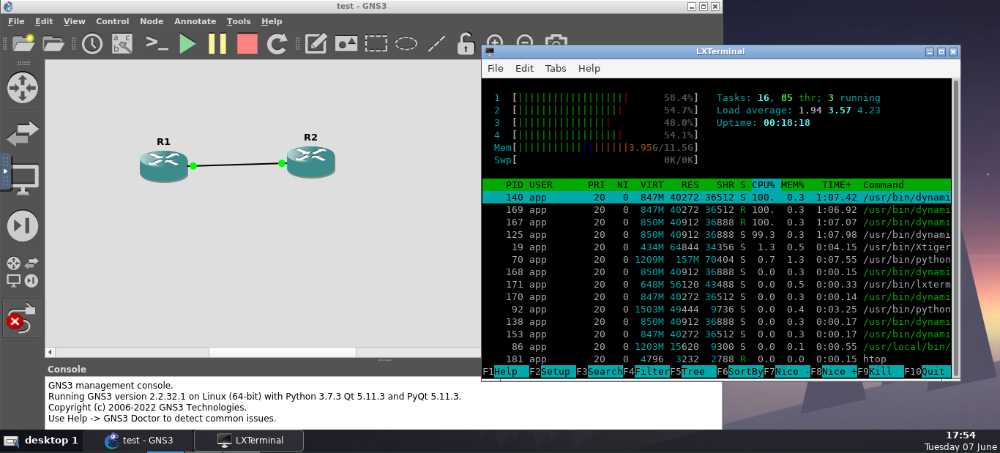
_Gns3 application preview_

3. Teacher

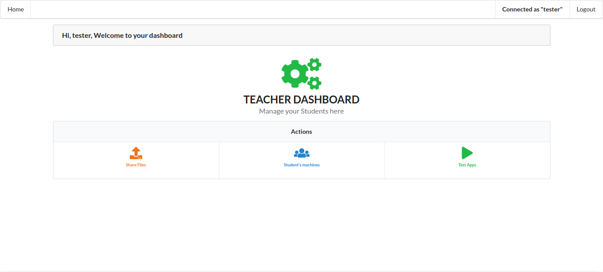
_Teacher dashboard_

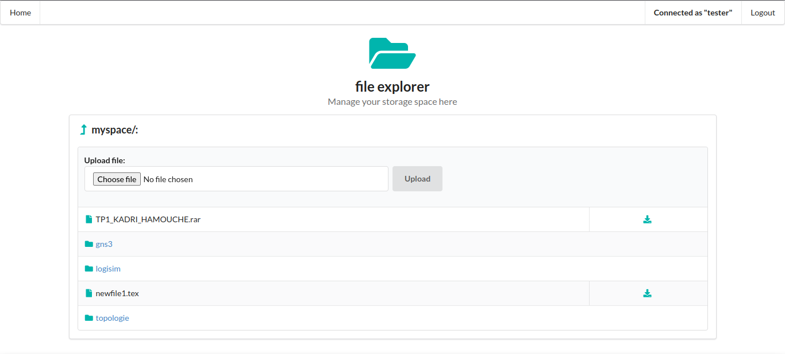
_Teacher file manager page_

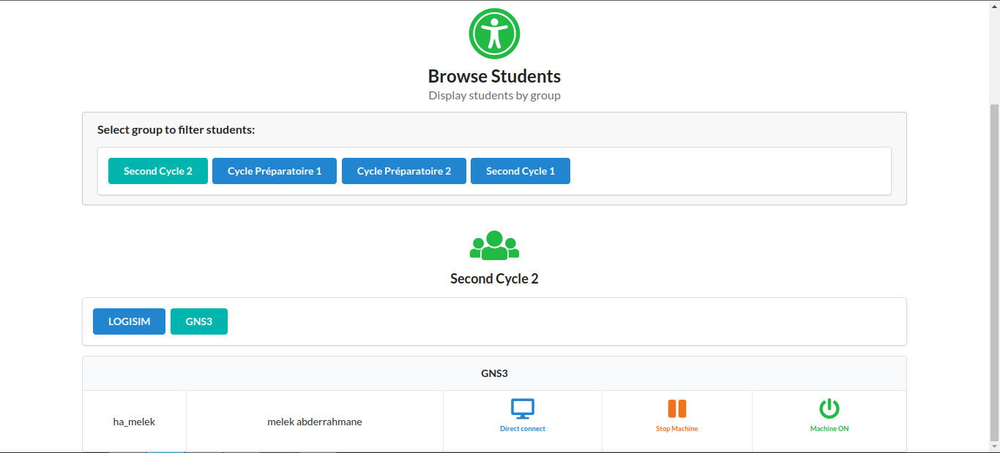
_student list page_

4. Admin


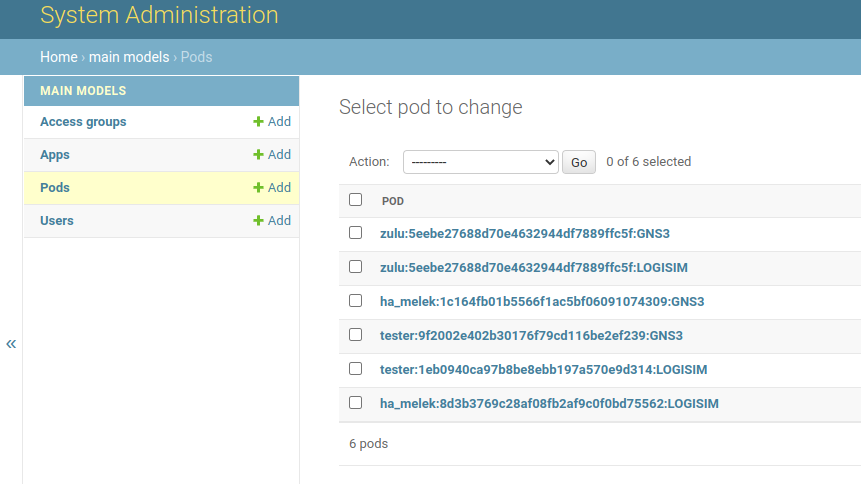
_DB instances_

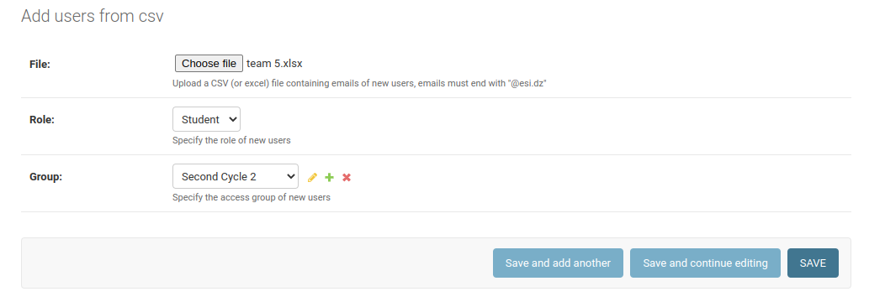
_Add users via CSV file_

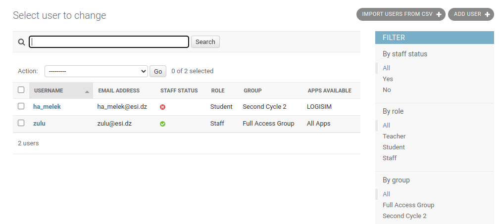
_Users dashboard_

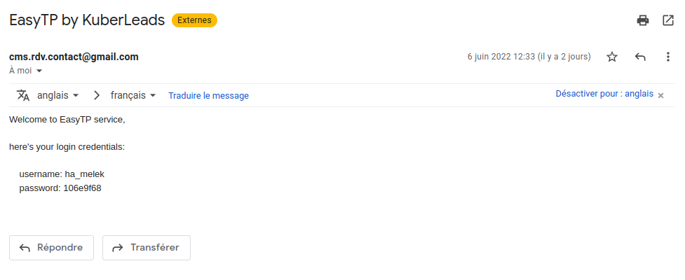
_Login credentials via email_


## Usage

- Connect to the web plateforme hosted locally (http://server_IP:31313/login).
- Authenticate, then choose an application to launch, you will be directed to a new tab to access the lab.
- Enter VNC password and connect to your lab !


## Getting started
These instructions will get you a copy of this project up running on your local environement.

### Prerequisites
* Docker
* cri-dockerd *(you can get it from [here](https://github.com/Mirantis/cri-dockerd))*
* Kubernetes (you can follow this [tutorial](https://phoenixnap.com/kb/install-kubernetes-on-ubuntu) to install kubeadm, kubelet and kubectl)

[//]: # (* Python 3 *&#40;you can get it from [here]&#40;https://www.python.org/downloads/&#41;&#41;*)

[//]: # (* virtualenv)

[//]: # (```sh)

[//]: # (pip install virtualenv)

[//]: # (```)

[//]: # (### Create a virtual environement)

[//]: # ()
[//]: # (```sh)

[//]: # (virtualenv "Your virtualenv name"  )

[//]: # (cd "Your virtualenv name")

[//]: # (Scripts\activate)

[//]: # (```)

### Installation
1. Create your cluster
```sh
swapoff -a
sudo kubeadm init --pod-network-cidr=10.244.0.0/16 --cri-socket=unix:///var/run/cri-dockerd.sock --apiserver-advertise-address=<your ip>

mkdir -p $HOME/.kube
sudo cp -i /etc/kubernetes/admin.conf $HOME/.kube/config
sudo chown $(id -u):$(id -g) $HOME/.kube/config
# install flannel: network plugin
kubectl apply -f https://raw.githubusercontent.com/coreos/flannel/master/Documentation/kube-flannel.yml
# enable scheduling on master
kubectl taint node --all node-role.kubernetes.io/master:NoSchedule-
kubectl taint node --all node-role.kubernetes.io/control-plane:NoSchedule-
```
2. Clone the repo
```sh
git clone https://github.com/TheDhm/container-manager-app.git
```
3. Create NFS storage (you can follow this [tutorial](https://www.tecmint.com/install-nfs-server-on-ubuntu/))
    * create DB folder in your nfs server (for postgres DB)
    * create USERDATA folder ( users storage space )
    * create READONLY folder
    * make sure to change nfs server IP in: 
      * postgres-pv.yaml
      * django-deployment.yaml
      * persistentVolume.yaml


4. Build the web app image
```sh
cd container-manager-app
docker build --rm -t django-app:latest .
```
5. Before you start the project make sur you have docker images locally :

[//]: # (* [Gns3]&#40;https://hub.docker.com/r/younes46/gns&#41;)

[//]: # (```sh )

[//]: # (docker pull younes46/gns)

[//]: # (docker tag younes46/gns gns3)

[//]: # (```)

[//]: # (* [Logisim]&#40;https://hub.docker.com/repository/docker/anii76/logisim&#41;)

[//]: # (```sh )

[//]: # (docker pull anii76/logisim)

[//]: # (docker tag anii76/logisim logisim)

[//]: # (```)

[//]: # (### Or)
you can build the images using dockerfiles in `Dockerfiles` (Logisim & GNS3)
```sh 
docker build -t <ImageName> <DockerfilePath>
```
6. Deploy on Kubernetes cluster
```sh
cd container-manager-app
sh deploy-all.sh
```
7. Migrate
```sh
kubectl -n django-space exec -it  <django pod> -- python manage.py migrate
```
8. Create superuser
```sh
kubectl -n django-space exec -it  <django pod> -- python manage.py createsuperuser
```

## Acknowledgment
Special thanks to M. BELHADI Zohir for helping us through this project.

## Contact
Contact KubeLeads Team:
> - Anfal Bourouina : ka_bourouina@esi.dz
> - Abderrahmane Melek : ha_melek@esi.dz 
> - Mohamed Branki : im_regani@esi.dz  
> - Mohamed Elghazali Kimeche : km_kimeche@esi.dz
> - Younes Otmani : ky_otmani@esi.dz
> - Kenza Makhloufi : kk_makhloufi@esi.dz

## License
